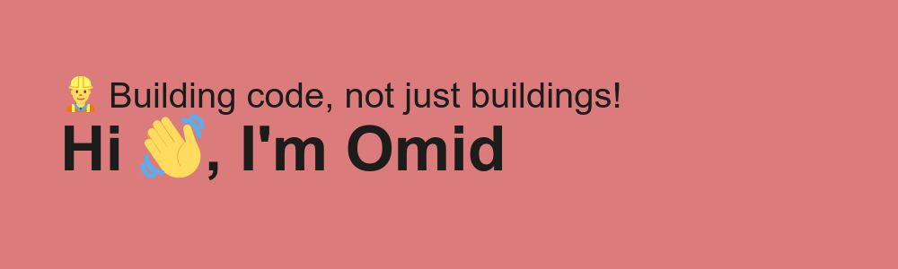

👋 Hi there! I'm an Architectural Master graduate with a passion for learning and creating. Inspired to dive into the world of coding, I'm on an exciting journey of discovery and innovation every day.

🌟 Background: With a strong foundation in architecture, I bring a unique perspective to problem-solving and design. My transition into tech has been fueled by a desire to blend the structural elegance of architecture with the dynamic possibilities of programming.

💡 Interests: Enthusiastic about software development, computational design, and exploring how technology can transform traditional architectural practices. I'm constantly experimenting with new languages, tools, and frameworks to expand my skill set.

🌍 Vision: To leverage my architectural expertise and coding skills to create sustainable, intelligent, and aesthetically pleasing solutions that make a positive impact on the world.

## 🏆 GitHub Profile
 

Let's connect and build something amazing together! 🚀

## 🤝 Get in Touch

